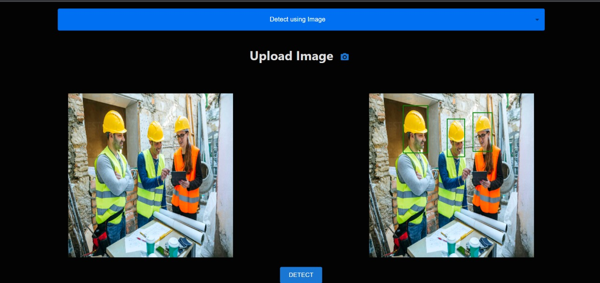
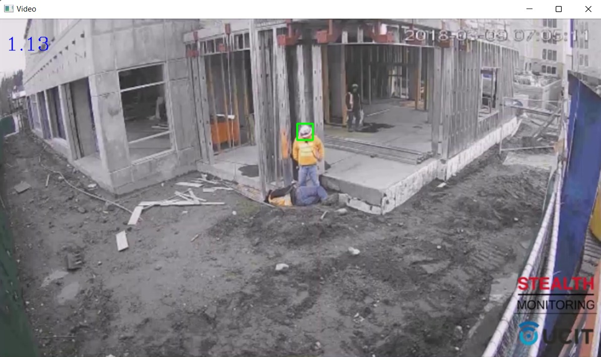
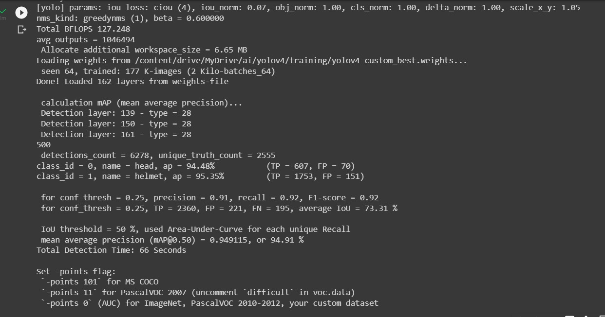
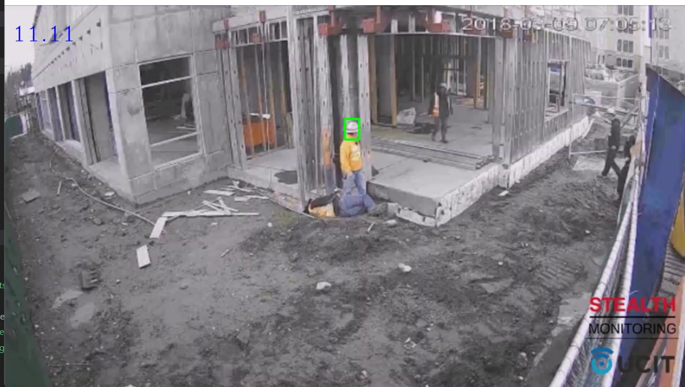
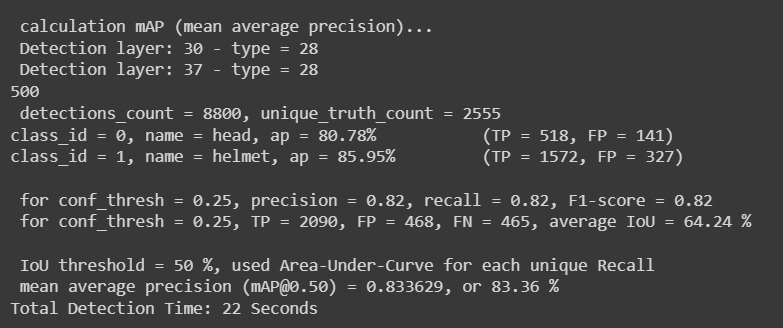

# Safety Helmet Detection 
## Objective: The objective of the project is to create a realtime object detection model for safety helmet.

## [Live Demo](https://helmet-detection-frontend-hcwvxl5l1-deepakdpyqaz.vercel.app/) : [https://helmet-detection-frontend-hcwvxl5l1-deepakdpyqaz.vercel.app/](https://helmet-detection-frontend-hcwvxl5l1-deepakdpyqaz.vercel.app/)

## Use Cases
- Can be used to detect safety helmet at construction sites
- Can be used at mining sites
- Model can be trained further to detect normal helmets as well

## Tools Used
- *Object Detection*: Yolov4 and tiny-yolov4
- *Front-end*: Next js
- *Back-end*: Flask

## Dataset Used: [Safety Helmet Detection](https://www.kaggle.com/datasets/andrewmvd/hard-hat-detection)

## Models Trained:
### 1. <b><u>YoloV4 model</u></b>
- *Model Size*: 244.2MB
- *Speed (in FPS for realtime prediction)*: 1-2 FPS (On CPU)

- *Accuracy*: 94.91%

### 2. <b><u>Tiny-yoloV4 model</u></b>
- *Model Size*: 22.4MB
- *Speed (in FPS for realtime prediction)*: 10-15 FPS (On CPU)

- *Accuracy*: 83.36%

- *Demo*

https://user-images.githubusercontent.com/77318262/165957850-135f295e-4f92-42c2-8a0f-dd615f0d462a.mp4

## Observation and Result
From the comparative observation, we can say that Yolov4 model is better in terms of accuracy but tiny-yolov4 is better in terms of model size and speed and only a little less in accuracy, so for deployment on web, tiny-yolo model is a better option as it will be light weight and work fast
